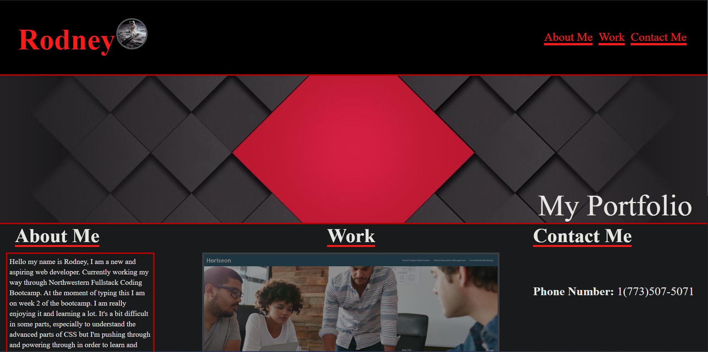

# My-Portfolio-Site

## Description
This is a webpage that I created that was for my portfolio. It is in the beginner stages because I am still learning. It is coded with both HTML and CSS. It details a brief history of my coding past going through both high school and college then all the way to where I am now with taking the NorthWestern Coding Bootcamp. Then it displays projects that I have worked on with the largest one being the only project that I actually worked on and the two smaller images being just place holders and examples projects that will eventually go there once I get more experience under my belt. Lastly on the farest right side of the webpage I have my contact information like phone number, email address, and my github account in order to see the portfolio site and other projects that I have worked on.

## Installation

N/A

## Usage

The use of this site is to look at the project work history of mine and learn more about me. By clicking the 'About Me', 'Work', or 'Contact Me' links at the top of the page it will direct you to the part of the webpage you are looking for. Then if you were to click on a specific project for example the first one it will send you to another webpage with that project displayed in another tab. Also if the screen is rezied it is shaped to screen of mobile devices.

```md


```
## Credits

N/A

## License

MIT License

Copyright (c) 2024 Yllaw0

Permission is hereby granted, free of charge, to any person obtaining a copy
of this software and associated documentation files (the "Software"), to deal
in the Software without restriction, including without limitation the rights
to use, copy, modify, merge, publish, distribute, sublicense, and/or sell
copies of the Software, and to permit persons to whom the Software is
furnished to do so, subject to the following conditions:

The above copyright notice and this permission notice shall be included in all
copies or substantial portions of the Software.

THE SOFTWARE IS PROVIDED "AS IS", WITHOUT WARRANTY OF ANY KIND, EXPRESS OR
IMPLIED, INCLUDING BUT NOT LIMITED TO THE WARRANTIES OF MERCHANTABILITY,
FITNESS FOR A PARTICULAR PURPOSE AND NONINFRINGEMENT. IN NO EVENT SHALL THE
AUTHORS OR COPYRIGHT HOLDERS BE LIABLE FOR ANY CLAIM, DAMAGES OR OTHER
LIABILITY, WHETHER IN AN ACTION OF CONTRACT, TORT OR OTHERWISE, ARISING FROM,
OUT OF OR IN CONNECTION WITH THE SOFTWARE OR THE USE OR OTHER DEALINGS IN THE
SOFTWARE.